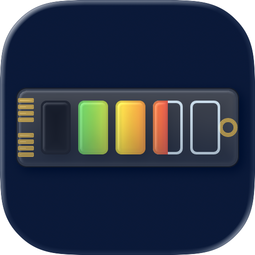

<div align="center">
  
      <h1>Derived</h1>
  <p>A native macOS menu-bar application for inspecting and removing storage created by Xcode, Simulator, and XCTest.</p>
  <p>
    
    
    
    
  </p>
</div>

> [!CAUTION]
> Derived permanently deletes selected developer data instead of moving it to the Trash. Review the cleanup plan before confirming deletion.

## Overview

Derived finds and removes storage created by Xcode, Simulator, and XCTest. It reports verified reclaimable space, keeps APFS clone sizes separate, and protects active or high-risk targets.

Use Derived through the macOS app, the `derived` CLI, or the local `derived-mcp` server. All three interfaces use the same scanner, path validation, and cleanup workflow. Derived runs locally and does not collect analytics.

| Interface | Intended use |
|---|---|
| macOS app | Interactive scans, cleanup selection, scheduling, and history |
| CLI | Terminal workflows, shell scripts, and structured JSON output |
| MCP server | Structured access for Codex, Claude Code, Cursor, and other MCP clients |

## Install the macOS app

### Homebrew (recommended)

```sh
brew tap adiaz0511/derived
brew install --cask derived
```

Update the app with:

```sh
brew update
brew upgrade --cask derived
```

### Disk image

1. Download the DMG from the [latest GitHub release](https://github.com/adiaz0511/Derived/releases/latest).
2. Open the disk image.
3. Drag `Derived.app` to Applications.
4. Open Derived from Applications.

## Install the CLI and MCP server

The agent tools include the `derived` CLI, the `derived-mcp` server, and the `derived-cleanup` skill. The macOS app is not required.

### Homebrew (recommended)

```sh
brew tap adiaz0511/derived
brew install --cask derived-tools
derived integrations install
```

`derived integrations install` detects Codex, Claude Code, and Cursor on the Mac. It registers the MCP server and installs the skill for each detected client.

Update the tools and refresh their integrations with:

```sh
derived integrations update
```

### Disk image

The [latest Derived DMG](https://github.com/adiaz0511/Derived/releases/latest) also includes **Derived Agent Tools** for installation without Homebrew.

1. Open the DMG.
2. Open **Derived Agent Tools**.
3. Select **Install for Codex**.
4. Restart Codex.

To update a DMG installation, download the latest DMG and run **Derived Agent Tools** again.

### MCPB installation

Clients that support MCPB bundles can install `Derived-MCP-VERSION-macOS-universal.mcpb` from the latest release. The MCPB contains the MCP server, but it does not install the `derived` CLI or portable skill.

## Use Derived with coding agents

Check which clients are configured:

```sh
derived --version
derived integrations status
```

Then start a new session in Codex, Claude Code, or Cursor and ask:

```text
Use $derived-cleanup to scan my developer storage.
```

See [Agent Integrations](docs/AGENT_INTEGRATIONS.md) for client-specific commands, manual configuration, and uninstallation.

## Use the CLI

The CLI provides aligned tables for interactive use and JSON for scripts and agents.

| Command | Purpose |
|---|---|
| `derived scan` | Scan Xcode, Simulator, and XCTest storage and print a scan ID |
| `derived list` | List candidates from one category in a previous scan |
| `derived prepare` | Create an expiring cleanup plan for selected items or categories |
| `derived delete` | Execute a prepared plan with its exact confirmation phrase |
| `derived integrations install` | Configure the MCP server and skill for supported coding agents |
| `derived integrations status` | Report installed agent integrations |
| `derived integrations update` | Update Homebrew-managed tools and refresh their integrations |

Start with a scan:

```sh
derived --version
derived scan
```

Use the scan ID printed by `derived scan` to inspect a category and prepare a plan:

```sh
derived list --scan SCAN_ID --category derivedData --limit 20
derived prepare --scan SCAN_ID --category previewData
```

Replace `SCAN_ID` with the UUID printed by the scan. Do not include angle brackets. The `prepare` command prints the exact confirmation phrase and complete `derived delete` command for that plan.

Use `--json` when another program will consume the output:

```sh
derived scan --json
derived list --scan SCAN_ID --category derivedData --limit 20 --json
```

Scan IDs expire after 30 minutes. Cleanup plans expire after 10 minutes and can be executed once.

## Features

### Storage discovery

- Scans Derived Data, SwiftUI previews, XCTest devices, simulators, runtimes, Device Support, logs, caches, archives, and temporary data.
- Reports verified reclaimable bytes separately from logical APFS clone sizes.
- Groups cleanup candidates by category and recommendation status.

### Cleanup and automation

- Cleans individual candidates, complete categories, or cross-category selections.
- Uses `simctl` to remove simulator devices and runtimes through supported system operations.
- Schedules cleanup for Derived Data, Xcode logs, and Xcode caches.
- Supports Launch at Login and maintains a local JSON Lines cleanup history.

### Safety

- Detects active development tools and protects active targets.
- Requires an expiring cleanup plan and exact confirmation before deletion.
- Revalidates every candidate immediately before cleanup.
- Never selects archives or simulator runtimes automatically.

## Safety model

Derived validates every cleanup target against a fixed allowlist. It rejects category roots, paths outside approved developer directories, malformed simulator identifiers, active targets, symbolic-link escapes, and candidates that changed after the plan was created.

Automatic cleanup waits until related development tools are closed and fails safely when process inspection is unavailable. XCTest APFS clone sizes are reported as logical sizes and excluded from verified reclaimable totals.

See [Safety](docs/SAFETY.md) for the complete deletion model and approved paths.

## Requirements

### Run Derived

- macOS 14.0 or later
- Xcode for Simulator discovery and `simctl`-backed cleanup

The DMG contains prebuilt universal applications and command-line tools. Building from source is not required.

Derived is intentionally not sandboxed because it manages files under `~/Library/Developer` and invokes `xcrun simctl`.

### Build from source

- Xcode 26.4 or later
- Swift 6.2 toolchain

Clone the repository, open `Derived.xcodeproj`, select the `Derived` scheme, and build the macOS target.

Command-line build:

```sh
xcodebuild \
  -project Derived.xcodeproj \
  -scheme Derived \
  -configuration Debug \
  -derivedDataPath /tmp/DerivedBuild \
  CODE_SIGNING_ALLOWED=NO \
  build
```

Run the application tests:

```sh
xcodebuild \
  -project Derived.xcodeproj \
  -scheme Derived \
  -configuration Debug \
  -destination 'platform=macOS' \
  -derivedDataPath /tmp/DerivedTests \
  CODE_SIGNING_ALLOWED=NO \
  test
```

Build and test the CLI and MCP server:

```sh
swift test
scripts/test-agent-protocol.sh
swift build -c release
```

Launch at Login requires a signed application installed in a stable location. It may not work from an unsigned development build.

## Project structure

- `Derived/App`: application lifecycle, menu-bar item, and panel management
- `Derived/Features`: SwiftUI presentation grouped by feature
- `Derived/Models`: cleanup, scan, automation, and reporting models
- `Derived/Services`: scanning, validation, process inspection, deletion, and persistence
- `Derived/Shared`: shared formatting and design constants
- `Derived/AgentIntegration`: shared CLI and MCP models, state, and safety workflow
- `DerivedTests`: safety and behavior tests
- `DerivedCLITests`: CLI argument, version, and human-readable output tests
- `DerivedCoreTests`: agent integration and destructive-operation safeguards
- `Tools`: native CLI and MCP executables
- `Integrations`: portable agent skills and packaging metadata

## Privacy

Derived operates locally. It does not include analytics, advertising, accounts, or network services. See [Privacy](PRIVACY.md).

## Contributing

Contributions are welcome. Read [Contributing](CONTRIBUTING.md) before changing scanner, validation, or deletion behavior.

Maintainers should follow [Releasing Derived](docs/RELEASING.md) for signing, notarization, DMG generation, and MCP publication.

## License

Derived is available under the [MIT License](LICENSE).
